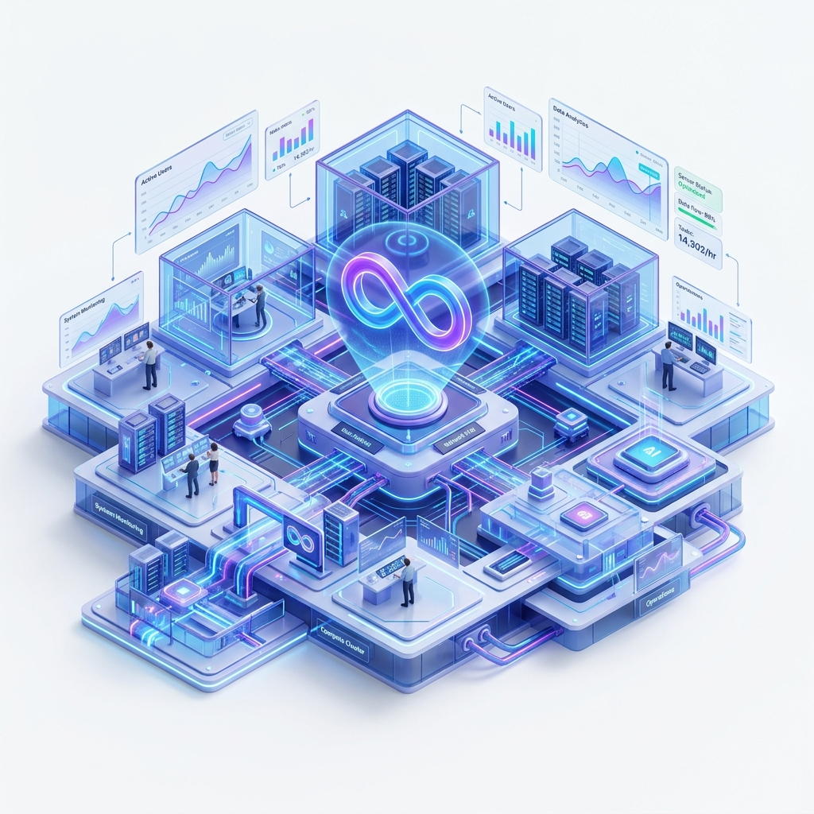

#  Agentic Facility Ops AI Platform

> An AI-powered Facility Operations Management Platform developed as part of the **Infosys Springboard Internship Program**.



---

## 📌 Project Overview

The **Agentic Facility Ops AI Platform** is a modern web-based application that demonstrates how autonomous AI agents can assist facility managers in monitoring, optimizing, and automating day-to-day facility operations.

The platform provides an intuitive dashboard where users can monitor AI agents, visualize operational metrics, manage modules, and simulate intelligent facility management workflows.

This project was developed during the **Infosys Springboard Internship** as part of the learning experience in AI-powered enterprise solutions and modern frontend development.

---

## ✨ Features

- 🤖 AI Agent Monitoring Dashboard
- 📊 Interactive Analytics & Statistics
- 🏢 Facility Operations Overview
- ⚡ Autonomous Agent Modules
- 🔍 Smart Search & Filtering
- 📈 Operational Performance Metrics
- 🧠 AI Diagnostics Simulation
- ➕ Add New AI Modules
- 📱 Responsive UI Design
- 🎨 Modern Glassmorphism Dashboard
- 🌙 Premium User Experience

---

## 🛠️ Technologies Used

- HTML5
- CSS3
- JavaScript (ES6)
- Responsive Web Design
- Modern UI/UX Principles

---

## 📂 Project Structure

```
Agentic-Facility-Ops-AI-Platform/
│
├── index.html
├── index.css
├── index.js
│
├── dashboard.html
├── dashboard.css
├── dashboard.js
│
├── style.css
├── hero-illustration.jpg
│
└── README.md
```

---

## 🚀 Getting Started

### 1. Clone the repository

```bash
git clone https://github.com/TanishkaSahil/Agentic-Facility-Ops-AI-Platform.git
```

### 2. Navigate to the project folder

```bash
cd Agentic-Facility-Ops-AI-Platform
```

### 3. Open the project

Simply open

```
index.html
```

in your browser.

No additional installation is required.

---

## 📷 Application Screens

### Landing Page

- Modern onboarding interface
- AI platform introduction
- 3-step setup process

### Dashboard

- Facility Overview
- AI Modules
- Analytics
- Monitoring
- Reports
- Asset Management
- Work Orders
- AI Diagnostics

---

## 🎯 Project Objectives

- Demonstrate Agentic AI concepts
- Simplify facility management workflows
- Improve operational efficiency
- Showcase interactive dashboard design
- Build responsive enterprise-grade UI

---

## 💡 Future Enhancements

- Backend Integration
- Database Connectivity
- Authentication & Authorization
- Live IoT Sensor Data
- AI Chat Assistant
- Predictive Maintenance
- Real-Time Notifications
- Cloud Deployment
- REST API Integration

---

## 👨‍💻 Internship Details

**Internship Program**- **Infosys Springboard**

**Project Title**- **Agentic Facility Ops AI Platform**

---

##  Project Members

~Tanishka Sahil
 ~Simran Dey
 ~Preethi S
 ~Rakshnavi P
 ~Veera Lakshmi Malladi


## 📚 Learning Outcomes

- Frontend Web Development
- Responsive UI Design
- JavaScript DOM Manipulation
- Dashboard Design
- AI-inspired User Experience
- Enterprise Application Development

---

## 📄 License

This project has been developed for educational and internship purposes under the **Infosys Springboard Internship Program**.

---

## 🙏 Acknowledgements

Special thanks to:

- **Infosys**
- **Infosys Springboard**
- Mentors and Trainers
- Internship Team

---

### ⭐ If you like this project, don't forget to give it a star!
